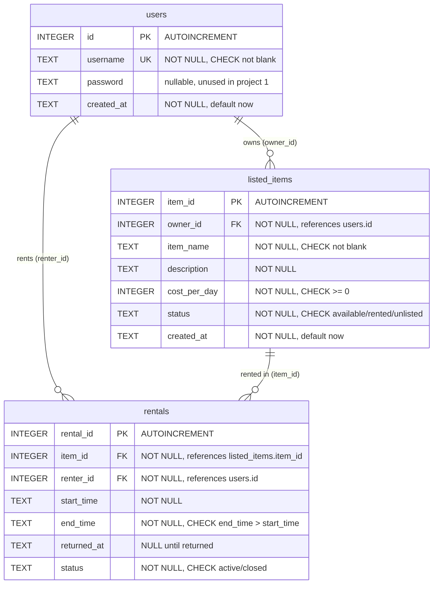

# Entity relationship diagram

## Constraints not shown in the boxes
- `rentals`: `CHECK` ties `status` to `returned_at` (active means NULL, closed means NOT NULL).
- `rentals`: a partial unique index allows only one active rental per item.
- Indexes: `listed_items(owner_id, status)` and `rentals(item_id)`.